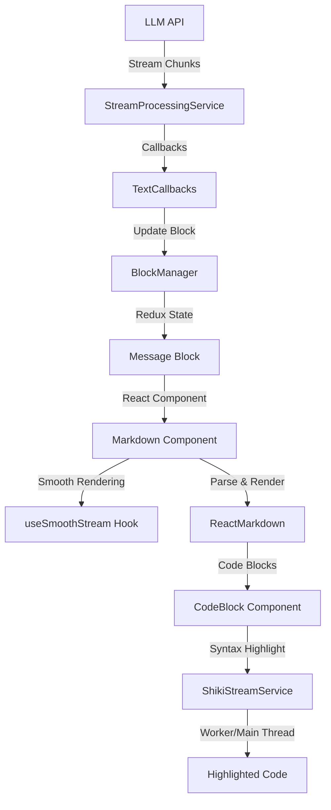

# Cherry Studio 流式输出与 Markdown 渲染教学指南

## 概述

本文档详细介绍 Cherry Studio 项目中如何实现流式输出（Streaming Output）以及 Markdown 格式的渲染支持。这是一个完整的端到端流程，从数据流的产生到最终在用户界面上的呈现。

## 目录

1. [架构概览](#架构概览)
2. [核心概念](#核心概念)
3. [流式输出系统](#流式输出系统)
4. [Markdown 渲染系统](#markdown-渲染系统)
5. [代码高亮系统](#代码高亮系统)
6. [关键文件索引](#关键文件索引)

---

## 架构概览



### 数据流向

1. **数据接收层**: LLM API 返回流式数据块（Chunks）
2. **处理层**: `StreamProcessingService` 解析并分发不同类型的 chunks
3. **状态管理层**: 通过 callbacks 更新 Redux 状态
4. **渲染层**: React 组件订阅状态变化并渲染
5. **优化层**: 平滑流式渲染和代码高亮

---

## 核心概念

### 1. Chunk 类型系统

项目定义了完整的 Chunk 类型枚举，用于标识流式数据的不同阶段和内容类型。

**文件位置**: [`src/renderer/src/types/chunk.ts`](file:///Users/zhangyixuan/project/openSource/cherry-studio/src/renderer/src/types/chunk.ts)

#### 主要 Chunk 类型

```typescript
export enum ChunkType {
  // 文本相关
  TEXT_START = 'text.start',           // 文本开始
  TEXT_DELTA = 'text.delta',           // 文本增量
  TEXT_COMPLETE = 'text.complete',     // 文本完成
  
  // 思考过程（如 Claude）
  THINKING_START = 'thinking.start',
  THINKING_DELTA = 'thinking.delta',
  THINKING_COMPLETE = 'thinking.complete',
  
  // 工具调用
  MCP_TOOL_PENDING = 'mcp_tool_pending',
  MCP_TOOL_IN_PROGRESS = 'mcp_tool_in_progress',
  MCP_TOOL_COMPLETE = 'mcp_tool_complete',
  MCP_TOOL_STREAMING = 'mcp_tool_streaming',
  
  // 图片生成
  IMAGE_CREATED = 'image.created',
  IMAGE_DELTA = 'image.delta',
  IMAGE_COMPLETE = 'image.complete',
  
  // 生命周期
  LLM_RESPONSE_CREATED = 'llm_response_created',
  LLM_RESPONSE_COMPLETE = 'llm_response_complete',
  BLOCK_COMPLETE = 'block_complete',
  ERROR = 'error'
}
```

#### Chunk 接口示例

```typescript
// 文本增量 Chunk
export interface TextDeltaChunk {
  text: string          // 增量文本内容
  chunk_id?: number     // Chunk ID
  type: ChunkType.TEXT_DELTA
}

// 文本完成 Chunk
export interface TextCompleteChunk {
  text: string          // 完整文本内容
  chunk_id?: number
  type: ChunkType.TEXT_COMPLETE
}
```

### 2. Message Block 系统

消息被组织成不同类型的 Block，每个 Block 代表一个独立的内容单元。

**主要 Block 类型**:
- `MAIN_TEXT`: 主要文本内容（支持 Markdown）
- `THINKING`: 思考过程
- `TOOL_CALL`: 工具调用
- `IMAGE`: 图片内容
- `CITATION`: 引用/搜索结果

---

## 流式输出系统

### 1. StreamProcessingService

这是流式处理的核心服务，负责接收和分发 chunks。

**文件位置**: [`src/renderer/src/services/StreamProcessingService.ts`](file:///Users/zhangyixuan/project/openSource/cherry-studio/src/renderer/src/services/StreamProcessingService.ts)

#### 核心接口

```typescript
export interface StreamProcessorCallbacks {
  // 文本内容回调
  onTextStart?: () => void
  onTextChunk?: (text: string) => void
  onTextComplete?: (text: string) => void
  
  // 思考内容回调
  onThinkingStart?: () => void
  onThinkingChunk?: (text: string, thinking_millsec?: number) => void
  onThinkingComplete?: (text: string, thinking_millsec?: number) => void
  
  // 工具调用回调
  onToolCallPending?: (toolResponse: MCPToolResponse | NormalToolResponse) => void
  onToolCallInProgress?: (toolResponse: MCPToolResponse | NormalToolResponse) => void
  onToolCallComplete?: (toolResponse: MCPToolResponse | NormalToolResponse) => void
  
  // 完成和错误回调
  onComplete?: (status: AssistantMessageStatus, response?: Response) => void
  onError?: (error: any) => void
}
```

#### 工作原理

```typescript
export function createStreamProcessor(callbacks: StreamProcessorCallbacks = {}) {
  return (chunk: Chunk) => {
    try {
      switch (chunk.type) {
        case ChunkType.TEXT_START: {
          if (callbacks.onTextStart) callbacks.onTextStart()
          break
        }
        case ChunkType.TEXT_DELTA: {
          if (callbacks.onTextChunk) callbacks.onTextChunk(chunk.text)
          break
        }
        case ChunkType.TEXT_COMPLETE: {
          if (callbacks.onTextComplete) callbacks.onTextComplete(chunk.text)
          break
        }
        // ... 处理其他类型
      }
    } catch (error) {
      callbacks.onError?.(error)
    }
  }
}
```

**关键特性**:
- 基于回调的事件驱动架构
- 类型安全的 chunk 处理
- 统一的错误处理机制

### 2. TextCallbacks

处理文本类型 chunks 的具体实现。

**文件位置**: [`src/renderer/src/services/messageStreaming/callbacks/textCallbacks.ts`](file:///Users/zhangyixuan/project/openSource/cherry-studio/src/renderer/src/services/messageStreaming/callbacks/textCallbacks.ts)

#### 核心逻辑

```typescript
export const createTextCallbacks = (deps: TextCallbacksDependencies) => {
  let mainTextBlockId: string | null = null

  return {
    // 文本开始：创建或更新 Block
    onTextStart: async () => {
      if (blockManager.hasInitialPlaceholder) {
        // 复用占位符 Block
        mainTextBlockId = blockManager.initialPlaceholderBlockId!
        blockManager.smartBlockUpdate(mainTextBlockId, {
          type: MessageBlockType.MAIN_TEXT,
          content: '',
          status: MessageBlockStatus.STREAMING
        })
      } else {
        // 创建新 Block
        const newBlock = createMainTextBlock(assistantMsgId, '', {
          status: MessageBlockStatus.STREAMING
        })
        mainTextBlockId = newBlock.id
        await blockManager.handleBlockTransition(newBlock)
      }
    },

    // 文本增量：更新 Block 内容
    onTextChunk: async (text: string) => {
      if (text) {
        blockManager.smartBlockUpdate(mainTextBlockId!, {
          content: text,  // 累积的完整文本
          status: MessageBlockStatus.STREAMING
        })
      }
    },

    // 文本完成：标记 Block 为完成状态
    onTextComplete: async (finalText: string) => {
      if (mainTextBlockId) {
        blockManager.smartBlockUpdate(mainTextBlockId, {
          content: finalText,
          status: MessageBlockStatus.SUCCESS
        })
        mainTextBlockId = null
      }
    }
  }
}
```

**设计要点**:
1. **状态管理**: 维护当前正在处理的 `mainTextBlockId`
2. **增量更新**: `onTextChunk` 接收的是累积的完整文本，而非增量
3. **生命周期**: 从 START → DELTA → COMPLETE 的完整流程

---

## Markdown 渲染系统

### 1. Markdown 组件

主要的 Markdown 渲染组件，支持流式渲染和丰富的格式。

**文件位置**: [`src/renderer/src/pages/home/Markdown/Markdown.tsx`](file:///Users/zhangyixuan/project/openSource/cherry-studio/src/renderer/src/pages/home/Markdown/Markdown.tsx)

#### 组件结构

```typescript
interface Props {
  block: MainTextMessageBlock | TranslationMessageBlock | ThinkingMessageBlock
  postProcess?: (text: string) => string  // 可选的后处理函数
}

const Markdown: FC<Props> = ({ block, postProcess }) => {
  const { mathEngine, mathEnableSingleDollar } = useSettings()
  
  // 流式渲染状态
  const [displayedContent, setDisplayedContent] = useState(
    postProcess ? postProcess(block.content) : block.content
  )
  const [isStreamDone, setIsStreamDone] = useState(
    block.status === 'success'
  )

  // 平滑流式渲染
  const { addChunk, reset } = useSmoothStream({
    onUpdate: (rawText) => {
      const finalText = postProcess ? postProcess(rawText) : rawText
      setDisplayedContent(finalText)
    },
    streamDone: isStreamDone,
    initialText: block.content
  })

  // 监听 block 内容变化
  useEffect(() => {
    const newContent = block.content || ''
    const oldContent = prevContentRef.current || ''
    
    // 检测是否是新 block 或内容重置
    if (isDifferentBlock || isContentReset) {
      reset(newContent)
    } else {
      // 计算增量并添加到渲染队列
      const delta = newContent.substring(oldContent.length)
      if (delta) {
        addChunk(delta)
      }
    }
    
    prevContentRef.current = newContent
  }, [block.content, block.id, block.status])

  return (
    <div className="markdown">
      <ReactMarkdown
        rehypePlugins={rehypePlugins}
        remarkPlugins={remarkPlugins}
        components={components}>
        {messageContent}
      </ReactMarkdown>
    </div>
  )
}
```

#### Remark/Rehype 插件配置

```typescript
// Remark 插件（Markdown 解析阶段）
const remarkPlugins = useMemo(() => {
  const plugins = [
    [remarkGfm, { singleTilde: false }],  // GitHub Flavored Markdown
    [remarkAlert],                         // GitHub 风格的警告块
    remarkCjkFriendly,                     // 中日韩友好
    remarkDisableConstructs(['codeIndented'])  // 禁用缩进代码块
  ]
  if (mathEngine !== 'none') {
    plugins.push([remarkMath, { singleDollarTextMath: mathEnableSingleDollar }])
  }
  return plugins
}, [mathEngine, mathEnableSingleDollar])

// Rehype 插件（HTML 转换阶段）
const rehypePlugins = useMemo(() => {
  const plugins: Pluggable[] = []
  if (ALLOWED_ELEMENTS.test(messageContent)) {
    plugins.push(rehypeRaw, rehypeScalableSvg)  // 支持原始 HTML 和 SVG
  }
  plugins.push([rehypeHeadingIds, { prefix: `heading-${block.id}` }])
  if (mathEngine === 'KaTeX') {
    plugins.push(rehypeKatex)
  } else if (mathEngine === 'MathJax') {
    plugins.push(rehypeMathjax)
  }
  return plugins
}, [mathEngine, messageContent, block.id])
```

#### 自定义组件映射

```typescript
const components = useMemo(() => {
  return {
    a: (props: any) => <Link {...props} />,
    code: (props: any) => <CodeBlock {...props} blockId={block.id} />,
    table: (props: any) => <Table {...props} blockId={block.id} />,
    img: (props: any) => <ImageViewer {...props} />,
    pre: (props: any) => <pre style={{ overflow: 'visible' }} {...props} />,
    svg: MarkdownSvgRenderer
  } as Partial<Components>
}, [block.id])
```

**支持的 Markdown 特性**:
- ✅ GitHub Flavored Markdown (GFM)
- ✅ 数学公式 (KaTeX/MathJax)
- ✅ 代码块语法高亮
- ✅ 表格
- ✅ 任务列表
- ✅ GitHub 风格警告块
- ✅ 原始 HTML/SVG
- ✅ 图片查看器
- ✅ 中日韩文本优化

### 2. useSmoothStream Hook

实现平滑的流式文本渲染效果。

**文件位置**: [`src/renderer/src/hooks/useSmoothStream.ts`](file:///Users/zhangyixuan/project/openSource/cherry-studio/src/renderer/src/hooks/useSmoothStream.ts)

#### 核心原理

```typescript
export const useSmoothStream = ({ 
  onUpdate, 
  streamDone, 
  minDelay = 10,
  initialText = '' 
}: UseSmoothStreamOptions) => {
  const chunkQueueRef = useRef<string[]>([])
  const animationFrameRef = useRef<number | null>(null)
  const displayedTextRef = useRef<string>(initialText)
  const lastUpdateTimeRef = useRef<number>(0)

  // 使用 Intl.Segmenter 进行字符分割（支持多语言）
  const segmenter = new Intl.Segmenter(languages)

  // 添加文本块到队列
  const addChunk = useCallback((chunk: string) => {
    const chars = Array.from(segmenter.segment(chunk)).map((s) => s.segment)
    chunkQueueRef.current = [...chunkQueueRef.current, ...(chars || [])]
  }, [])

  // 渲染循环
  const renderLoop = useCallback((currentTime: number) => {
    // 1. 队列为空时的处理
    if (chunkQueueRef.current.length === 0) {
      if (streamDone) {
        onUpdate(displayedTextRef.current)
        return  // 停止循环
      }
      animationFrameRef.current = requestAnimationFrame(renderLoop)
      return
    }

    // 2. 时间控制（最小延迟）
    if (currentTime - lastUpdateTimeRef.current < minDelay) {
      animationFrameRef.current = requestAnimationFrame(renderLoop)
      return
    }
    lastUpdateTimeRef.current = currentTime

    // 3. 动态计算渲染字符数
    let charsToRenderCount = Math.max(1, Math.floor(chunkQueueRef.current.length / 5))
    if (streamDone) {
      charsToRenderCount = chunkQueueRef.current.length  // 流结束时一次性渲染
    }

    // 4. 更新显示内容
    const charsToRender = chunkQueueRef.current.slice(0, charsToRenderCount)
    displayedTextRef.current += charsToRender.join('')
    onUpdate(displayedTextRef.current)

    // 5. 更新队列
    chunkQueueRef.current = chunkQueueRef.current.slice(charsToRenderCount)

    // 6. 继续下一帧
    if (chunkQueueRef.current.length > 0) {
      animationFrameRef.current = requestAnimationFrame(renderLoop)
    }
  }, [streamDone, onUpdate, minDelay])

  return { addChunk, reset }
}
```

**设计亮点**:
1. **国际化支持**: 使用 `Intl.Segmenter` 正确分割多语言字符（包括 emoji、中文等）
2. **自适应速度**: 根据队列长度动态调整每帧渲染的字符数
3. **性能优化**: 使用 `requestAnimationFrame` 而非 `setTimeout`
4. **平滑体验**: 最小延迟控制确保流畅的视觉效果

---

## 代码高亮系统

### 1. CodeBlock 组件

处理 Markdown 中的代码块渲染。

**文件位置**: [`src/renderer/src/pages/home/Markdown/CodeBlock.tsx`](file:///Users/zhangyixuan/project/openSource/cherry-studio/src/renderer/src/pages/home/Markdown/CodeBlock.tsx)

```typescript
const CodeBlock: React.FC<Props> = ({ children, className, node, blockId }) => {
  // 提取语言信息
  const languageMatch = /language-([\w-+]+)/.exec(className || '')
  const language = languageMatch?.[1] ?? (isMultiline ? 'text' : null)
  
  // 获取消息块状态
  const msgBlock = messageBlocksSelectors.selectById(store.getState(), blockId)
  const isStreaming = useMemo(
    () => msgBlock?.status === MessageBlockStatus.STREAMING, 
    [msgBlock?.status]
  )

  if (language !== null) {
    // 特殊处理 HTML（可预览）
    if (codeFancyBlock && language === 'html') {
      const isOpenFence = isOpenFenceBlock(children?.length, ...)
      return (
        <HtmlArtifactsCard 
          html={children} 
          onSave={handleSave} 
          isStreaming={isStreaming && isOpenFence} 
        />
      )
    }

    // 通用代码块
    return (
      <CodeBlockView language={language} onSave={handleSave}>
        {children}
      </CodeBlockView>
    )
  }

  // 行内代码
  return <code className={className}>{children}</code>
}
```

### 2. ShikiStreamService

高性能的流式代码高亮服务。

**文件位置**: [`src/renderer/src/services/ShikiStreamService.ts`](file:///Users/zhangyixuan/project/openSource/cherry-studio/src/renderer/src/services/ShikiStreamService.ts)

#### 架构设计

```typescript
class ShikiStreamService {
  // 主线程 highlighter
  private highlighter: HighlighterGeneric<any, any> | null = null
  
  // Tokenizer 缓存（LRU）
  private tokenizerCache = new LRUCache<string, ShikiStreamTokenizer>({
    max: 100,
    ttl: 1000 * 60 * 30  // 30分钟
  })
  
  // Worker 实例
  private worker: Worker | null = null
  
  // 降级策略缓存
  private workerDegradationCache = new LRUCache<string, boolean>({
    max: 500,
    ttl: 1000 * 60 * 60 * 12  // 12小时
  })
}
```

#### 流式高亮流程

```typescript
async highlightStreamingCode(
  code: string,
  language: string,
  theme: string,
  callerId: string
): Promise<HighlightChunkResult> {
  const cacheKey = `${callerId}-${language}-${theme}`
  const lastContent = this.codeCache.get(cacheKey) || ''

  let isAppend = false

  // 检测是否为追加模式
  if (code.length > lastContent.length) {
    isAppend = code.startsWith(lastContent)
  }

  if (isAppend) {
    // 流式追加：只高亮增量部分
    const chunk = code.slice(lastContent.length)
    result = await this.highlightCodeChunk(chunk, language, theme, callerId)
  } else {
    // 非追加：重置并高亮完整内容
    this.cleanupTokenizers(callerId)
    result = await this.highlightCodeChunk(code, language, theme, callerId)
    result.recall = -1  // 撤回所有行
  }

  // 更新缓存
  this.codeCache.set(cacheKey, code)
  return result
}
```

#### Worker 优先策略

```typescript
async highlightCodeChunk(
  chunk: string,
  language: string,
  theme: string,
  callerId: string
): Promise<HighlightChunkResult> {
  // 检查是否需要降级
  if (this.workerDegradationCache.has(callerId)) {
    return this.highlightWithMainThread(chunk, language, theme, callerId)
  }

  // 初始化 Worker
  if (!this.worker) {
    await this.initWorker()
  }

  // 优先使用 Worker
  if (this.hasWorkerHighlighter()) {
    try {
      return await this.sendWorkerMessage({
        type: 'highlight',
        callerId,
        chunk,
        language,
        theme
      })
    } catch (error) {
      // Worker 失败，永久降级到主线程
      this.workerDegradationCache.set(callerId, true)
      logger.error('Worker failed, falling back to main thread')
    }
  }

  // 使用主线程处理
  return this.highlightWithMainThread(chunk, language, theme, callerId)
}
```

**性能优化策略**:
1. **Worker 多线程**: 优先使用 Web Worker 避免阻塞主线程
2. **LRU 缓存**: 缓存 tokenizer 和代码内容
3. **增量高亮**: 只高亮新增的代码部分
4. **降级机制**: Worker 失败时自动降级到主线程
5. **超时控制**: 防止长时间阻塞

---

## 关键文件索引

### 流式处理核心

| 文件 | 功能 | 位置 |
|------|------|------|
| `chunk.ts` | Chunk 类型定义 | [`src/renderer/src/types/chunk.ts`](file:///Users/zhangyixuan/project/openSource/cherry-studio/src/renderer/src/types/chunk.ts) |
| `StreamProcessingService.ts` | 流式处理服务 | [`src/renderer/src/services/StreamProcessingService.ts`](file:///Users/zhangyixuan/project/openSource/cherry-studio/src/renderer/src/services/StreamProcessingService.ts) |
| `textCallbacks.ts` | 文本回调处理 | [`src/renderer/src/services/messageStreaming/callbacks/textCallbacks.ts`](file:///Users/zhangyixuan/project/openSource/cherry-studio/src/renderer/src/services/messageStreaming/callbacks/textCallbacks.ts) |

### Markdown 渲染

| 文件 | 功能 | 位置 |
|------|------|------|
| `Markdown.tsx` | 主 Markdown 组件 | [`src/renderer/src/pages/home/Markdown/Markdown.tsx`](file:///Users/zhangyixuan/project/openSource/cherry-studio/src/renderer/src/pages/home/Markdown/Markdown.tsx) |
| `CodeBlock.tsx` | 代码块组件 | [`src/renderer/src/pages/home/Markdown/CodeBlock.tsx`](file:///Users/zhangyixuan/project/openSource/cherry-studio/src/renderer/src/pages/home/Markdown/CodeBlock.tsx) |
| `useSmoothStream.ts` | 平滑流式渲染 Hook | [`src/renderer/src/hooks/useSmoothStream.ts`](file:///Users/zhangyixuan/project/openSource/cherry-studio/src/renderer/src/hooks/useSmoothStream.ts) |
| `markdown.css` | Markdown 样式 | [`src/renderer/src/assets/styles/markdown.css`](file:///Users/zhangyixuan/project/openSource/cherry-studio/src/renderer/src/assets/styles/markdown.css) |

### 代码高亮

| 文件 | 功能 | 位置 |
|------|------|------|
| `ShikiStreamService.ts` | 流式代码高亮服务 | [`src/renderer/src/services/ShikiStreamService.ts`](file:///Users/zhangyixuan/project/openSource/cherry-studio/src/renderer/src/services/ShikiStreamService.ts) |
| `ShikiStreamTokenizer.ts` | 流式 Tokenizer | [`src/renderer/src/services/ShikiStreamTokenizer.ts`](file:///Users/zhangyixuan/project/openSource/cherry-studio/src/renderer/src/services/ShikiStreamTokenizer.ts) |

### 工具函数

| 文件 | 功能 | 位置 |
|------|------|------|
| `markdown.ts` | Markdown 工具函数 | [`src/renderer/src/utils/markdown.ts`](file:///Users/zhangyixuan/project/openSource/cherry-studio/src/renderer/src/utils/markdown.ts) |
| `markdownConverter.ts` | Markdown 转换器 | [`src/renderer/src/utils/markdownConverter.ts`](file:///Users/zhangyixuan/project/openSource/cherry-studio/src/renderer/src/utils/markdownConverter.ts) |

---

## 学习路径建议

### 初级：理解基础概念

1. 阅读 [`chunk.ts`](file:///Users/zhangyixuan/project/openSource/cherry-studio/src/renderer/src/types/chunk.ts) 了解数据结构
2. 查看 [`StreamProcessingService.ts`](file:///Users/zhangyixuan/project/openSource/cherry-studio/src/renderer/src/services/StreamProcessingService.ts) 理解流式处理
3. 学习 [`useSmoothStream.ts`](file:///Users/zhangyixuan/project/openSource/cherry-studio/src/renderer/src/hooks/useSmoothStream.ts) 的平滑渲染机制

### 中级：掌握渲染流程

1. 深入 [`Markdown.tsx`](file:///Users/zhangyixuan/project/openSource/cherry-studio/src/renderer/src/pages/home/Markdown/Markdown.tsx) 了解 Markdown 渲染
2. 研究 [`textCallbacks.ts`](file:///Users/zhangyixuan/project/openSource/cherry-studio/src/renderer/src/services/messageStreaming/callbacks/textCallbacks.ts) 的状态管理
3. 探索 [`CodeBlock.tsx`](file:///Users/zhangyixuan/project/openSource/cherry-studio/src/renderer/src/pages/home/Markdown/CodeBlock.tsx) 的代码块处理

### 高级：优化和扩展

1. 分析 [`ShikiStreamService.ts`](file:///Users/zhangyixuan/project/openSource/cherry-studio/src/renderer/src/services/ShikiStreamService.ts) 的性能优化
2. 理解 Worker 多线程架构
3. 学习缓存策略和降级机制

---

## 总结

Cherry Studio 的流式输出和 Markdown 渲染系统是一个精心设计的架构，具有以下特点：

✅ **类型安全**: 完整的 TypeScript 类型定义  
✅ **性能优化**: Worker 多线程、LRU 缓存、增量渲染  
✅ **用户体验**: 平滑的流式效果、丰富的 Markdown 支持  
✅ **可扩展性**: 插件化的 Markdown 处理、模块化的回调系统  
✅ **容错机制**: 降级策略、错误处理、超时控制  

通过学习这个系统，你可以掌握：
- 流式数据处理的最佳实践
- React 中的性能优化技巧
- Web Worker 的实际应用
- Markdown 渲染的完整方案
